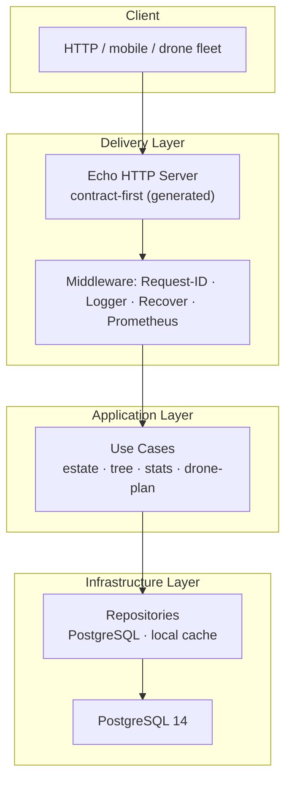

<p align="center">
  
  
  
  
  
</p>

<h1 align="center">🌴 Plantation Engine</h1>

<p align="center">
  A production-grade <strong>palm oil plantation intelligence</strong> backend —
  digital estates, per-tree inventory, live statistics, and <em>autonomous drone
  route planning</em> over a real grid map.
  <br/>
  <strong>Contract-first · Clean Architecture · Observable · Fully Tested</strong>
</p>

<p align="center">
  <a href="#-features">Features</a> ·
  <a href="#%EF%B8%8F-architecture">Architecture</a> ·
  <a href="#-getting-started">Getting Started</a> ·
  <a href="#-api-reference">API Reference</a> ·
  <a href="#-testing">Testing</a> ·
  <a href="#-project-layout">Project Layout</a>
</p>

---

## ✨ Features

| Feature | Description |
|---------|-------------|
| 🗺️ **Estate Mapping** | Register palm oil estates as a grid of plantable plots (`width × length`, up to 5000×5000). |
| 🌱 **Per-Tree Inventory** | Plant individual trees at `(x, y)` coordinates with recorded height — one tree per plot, atomically enforced. |
| 📊 **Live Estate Statistics** | Aggregated `count`, `min`, `max`, and `median` tree heights — computed asynchronously in the background so reads never block. |
| 🛸 **Drone Route Planning** | A **boustrophedon (zig-zag)** sweep path that visits every plot in the estate, returns the total flight distance, and computes the exact rest/battery-swap coordinate given a `max_distance` budget. |
| 🔄 **Smart Caching** | Thread-safe in-memory cache for drone rest coordinates, keyed by estate + battery budget — identical queries return instantly, auto-invalidated when the estate changes. |
| 🔍 **Observable by Default** | Structured JSON logging (`slog`), a request-ID middleware for end-to-end tracing, and Prometheus metrics (`/metrics`) out of the box. |
| 🏗️ **Contract-First Development** | The OpenAPI 3.0 spec is the single source of truth — handlers, types, and server stubs are generated, never hand-written. |
| 🧪 **Triple-Layered Testing** | Unit tests (mocked DB), black-box API tests, and real-PostgreSQL integration tests via Testcontainers. |

---

## 🏛️ Architecture

A strict, dependency-inward **Clean Architecture**:



**Request lifecycle** — every request carries a generated `X-Request-Id`, is timed
into Prometheus histograms, flows through use cases, and lands in PostgreSQL
through a connection-pooled driver. Graceful shutdown drains in-flight requests
on `SIGINT`/`SIGTERM`.

### 🛸 The Drone Algorithm

The route planner performs a **boustrophedon traversal** — sweeping the estate
grid row by row, alternating direction per row like a tractor or mowing path:

```
Row 0:  (1,0) → (2,0) → (3,0) → ... → (width,0)
Row 1:  (width,1) ← ... ← (3,1) ← (2,1) ← (1,1)
Row 2:  (1,2) → (2,2) → (3,2) → ... → (width,2)
```

The engine computes the **total flight distance** across all trees and, given a
`max_distance` (battery budget), pinpoints the **rest coordinate** where the
drone must stop — cached per estate/budget so repeated planning is instant.

---

## 🧰 Tech Stack

| Layer | Choice |
|-------|--------|
| Language | **Go 1.21** |
| HTTP Framework | **Echo v4** |
| Database | **PostgreSQL 14** |
| API Contract | **OpenAPI 3.0 + oapi-codegen v2** |
| Metrics | **Prometheus client_golang** |
| Logging | **`log/slog` (structured JSON)** |
| Unit Testing | **testify · sqlmock · golang/mock** |
| Integration Testing | **Testcontainers** (real Postgres in Docker) |
| Deployment | **Docker / Docker Compose** |
| CI | **GitHub Actions** (build · lint · test · integration) |

---

## 🚀 Getting Started

### Prerequisites

- [Go](https://golang.org/doc/install) **1.21** (or later 1.21.x)
- [GNU Make](https://www.gnu.org/software/make/)
- [Docker](https://docs.docker.com/get-docker/) + Docker Compose

### Run it

```bash
# 1. Generate code from the OpenAPI contract + pull dependencies
make init

# 2. Build the binary
make

# 3. Spin up the full stack (API + PostgreSQL) and run the test suite
./run.sh
```

Or run the API + database directly:

```bash
docker compose up --build -d
curl http://localhost:8080/hello?id=1
```

> The service listens on `:1323`; Compose maps it to `http://localhost:8080`.
> Changed `database.sql`? Rebuild the schema with `docker compose down --volumes`.

---

## 🔌 API Reference

| Method | Path | Description |
|--------|------|-------------|
| `GET` | `/hello?id=1` | Liveness probe |
| `POST` | `/estate` | Create a plantation estate |
| `POST` | `/estate/{estate_id}/tree` | Plant a tree at `(x, y)` with `height` |
| `GET` | `/estate/{estate_id}/stats` | Tree statistics (`count/min/max/median`) |
| `GET` | `/estate/{estate_id}/drone-plan` | Drone route distance + rest coordinate |
| `GET` | `/metrics` | Prometheus metrics |

### Examples

**Create an estate**

```bash
curl -s -X POST http://localhost:8080/estate \
  -H "Content-Type: application/json" \
  -d '{"width": 10, "length": 5}'
# → {"id":"5a9dcbba-e9d4-4814-8f5d-bef3edc426fe"}
```

**Plant a tree**

```bash
curl -s -X POST http://localhost:8080/estate/5a9dcbba-e9d4-4814-8f5d-bef3edc426fe/tree \
  -H "Content-Type: application/json" \
  -d '{"x": 4, "y": 3, "height": 12}'
# → {"id":"..."}
```

**Estate statistics**

```bash
curl -s http://localhost:8080/estate/5a9dcbba-e9d4-4814-8f5d-bef3edc426fe/stats
# → {"count":3,"min":3,"max":5,"median":4.5}
```

**Plan the drone route**

```bash
curl -s "http://localhost:8080/estate/5a9dcbba-e9d4-4814-8f5d-bef3edc426fe/drone-plan?max_distance=50"
# → {"distance":54,"rest":{"x":4,"y":3}}
```

**Error contract** — every failure returns a structured payload:

```json
{ "message": "Block already has a tree" }
```

Semantics: `400` invalid input · `404` unknown estate · `409` plot conflict.

---

## 🧪 Testing

A three-tier test strategy, all runnable via Make:

| Command | Covers |
|---------|--------|
| `make test` | Unit tests (mocked DB via `sqlmock`) + coverage report |
| `make test_api` | Black-box API tests against a live server |
| `make integration-test` | Real PostgreSQL via Testcontainers |

```bash
make test                # unit + coverage
make test_api            # end-to-end HTTP
make integration-test    # real Postgres in Docker
```

CI (**GitHub Actions**) runs every tier on every push: build → `golangci-lint`
(`errcheck`, `govet`, `staticcheck`, `unused`, `ineffassign`, `misspell`) →
`make init` (verifies generated code is in sync) → unit tests → integration.

---

## 📂 Project Layout

```
.
├── api.yml                  # OpenAPI 3.0 contract — single source of truth
├── cmd/                     # Entry point — main.go: wiring, middleware, graceful shutdown
├── handler/                 # HTTP layer + Prometheus middleware
├── usecase/                 # Business logic — one file per use case: estate · tree · stats · drone-plan
├── repository/              # Data access: PostgreSQL + local cache
├── validator/               # Request validation rules
├── helper/                  # Drone route & grid algorithms
├── model/                   # Domain models
├── integration/             # Testcontainers-based DB integration tests
├── tests/                   # Black-box API tests
├── generated/               # oapi-codegen output (types · server · spec)
├── tools.go                 # Codegen tool bootstrap (oapi-codegen)
├── database.sql             # Idempotent schema bootstrap
├── note.erd                 # Entity-relationship design notes
├── Dockerfile               # Multi-stage build (golang:1.21-alpine)
├── docker-compose.yml       # API + PostgreSQL orchestration
├── run.sh                   # One-shot dev bootstrap script
├── Makefile                 # init · generate · test · test_api · integration-test
├── go.mod / go.sum          # Go module definition & checksums
├── .github/workflows/       # CI: build · lint · codegen sync · test
├── .golangci.yml            # Linter configuration
└── LICENSE                  # MIT License
```

> Local artifacts (`build/`, `vendor/`, `coverage.out`) are gitignored and
> regenerated by `make init`.

---

## 🗺️ Roadmap

Ideas we're excited about next:

- [ ] AuthN/AuthZ (JWT + role-based estate ownership)
- [ ] Pagination & aggregation across estates
- [ ] Drone battery-cost model with elevation/weather inputs
- [ ] GeoJSON export of estates and routes
- [ ] OpenTelemetry tracing end-to-end

---

## 📄 License

Released under the [MIT License](LICENSE). Built with ❤️ for modern agriculture.
